# 智慧青科大健康打卡腾讯云版

## 腾讯云函数已经开始收费！！！建议自建服务器打卡！！！

### 下载
```
git clone https://github.com/crazy-zxx/HealthRecordCloud.git
```
或者直接 code --> Download Zip ，然后解压

### 使用

#### 配置

```
# 进入目录，直接下载的解压后文件夹名字可能是HealthRecordCloud-master
cd HealthRecordCloud
```
修改index.py中的用户名密码
```
# ------------------  只需要在此处设置你的智慧青科大账号和密码即可   ------------------------
# 用户名
un = '4021110075'
# 密码
pd = '12345678'
```
修改sendEmail.py中的邮箱配置
```
# 使用第三方 SMTP 服务（请自行参照邮箱厂商提供信息修改）
# 以QQ为例
mail_host = "smtp.qq.com"  # 设置服务器
mail_user = "1934109821@qq.com"  # 用户名（你的QQ账号@qq.com）
mail_pass = "qwertyuiopasdfgh"  # 口令（先要开启SMTP，口令是16位字母）

# 发件人邮箱
sender = '1934109821@qq.com'
# 收件人邮箱(设置为自己接受邮件通知的邮箱)
receivers = ['1934109821@qq.com']
```
QQ邮箱SMTP开启：
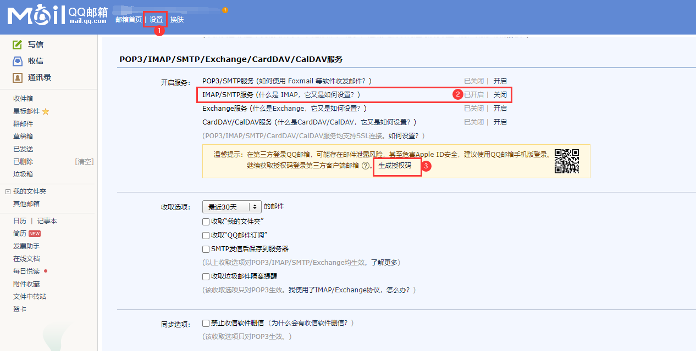


#### 环境搭建
[点击进入腾讯云函数服务官网](https://cloud.tencent.com/product/scf)
<br><br>
1.直接QQ登录就行，右上角进控制台
<br>
（新用户初次登录可能需要授权啥玩意的，按引导来，允许吧，我也没仔细看QAQ）
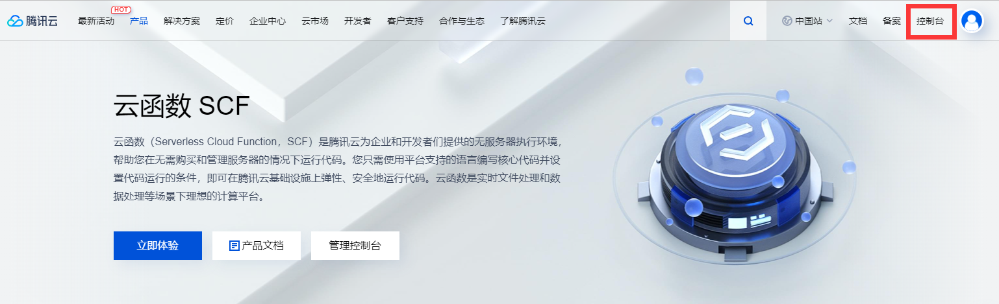
<br><br>
2.搜索云函数
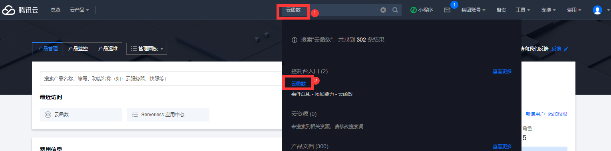
<br><br>
3.进入函数服务面板
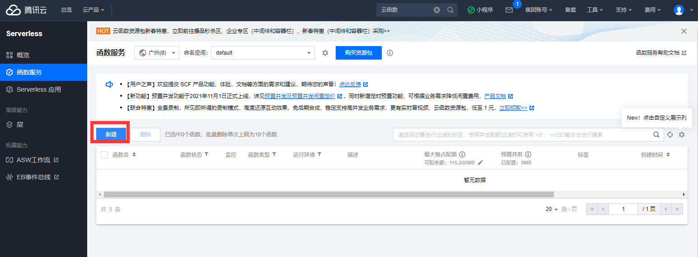
<br><br>
4.创建一个新的函数服务
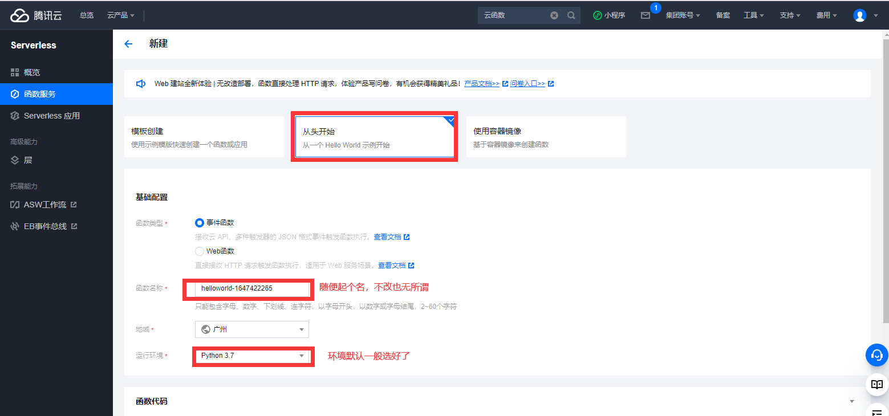
<br><br>
5.选择本项目所在目录上传代码
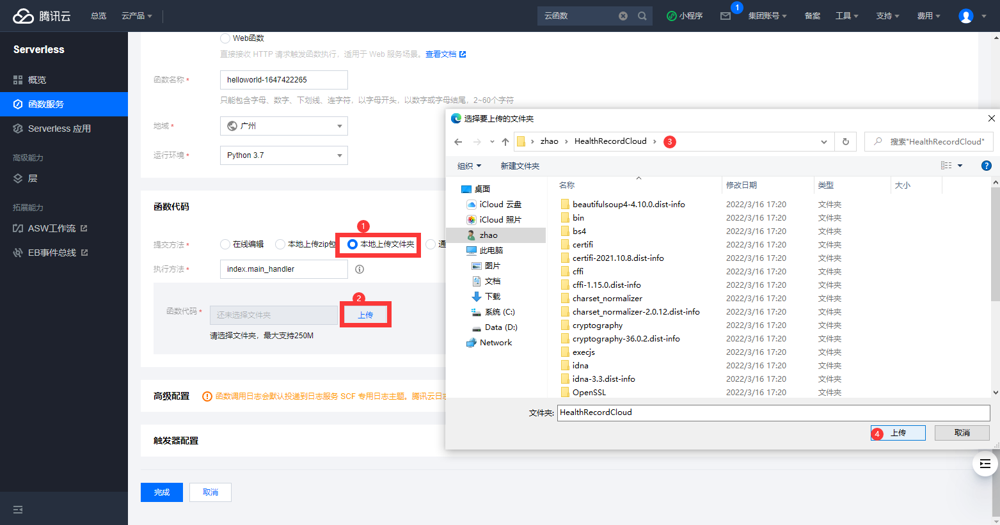
<br><br>
6.设置触发器，定时运行打卡
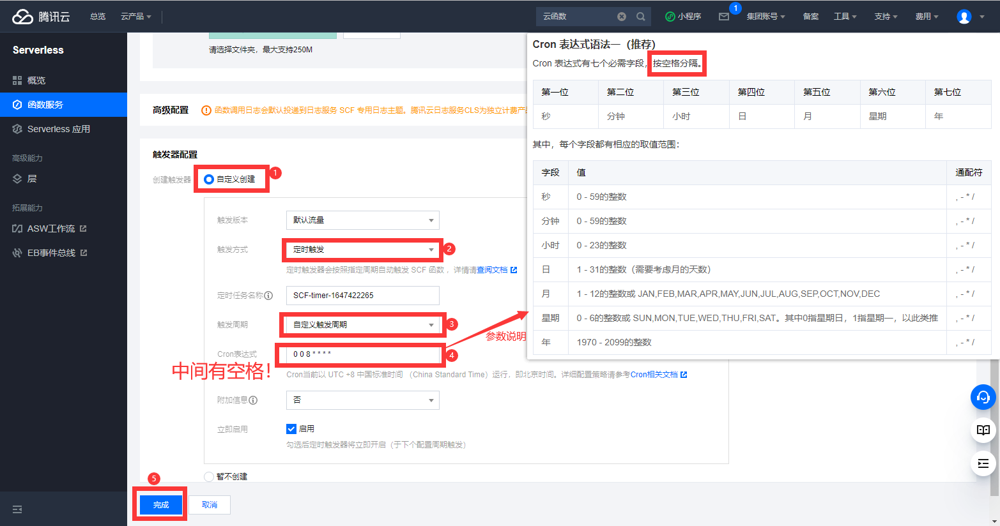
<br><br>
7.新函数服务创建完成，需要调整函数配置
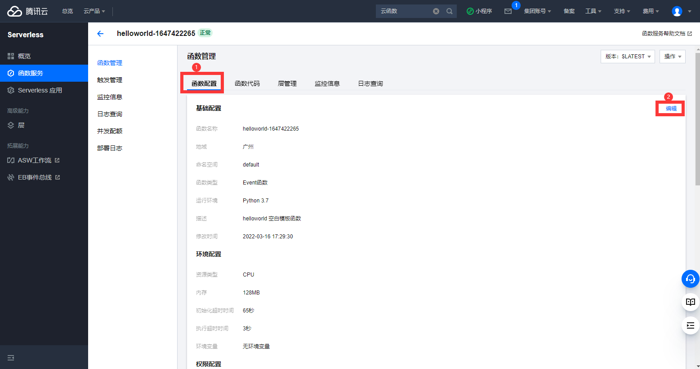
<br><br>
8.设置执行超时时间，避免未执行完代码就结束了
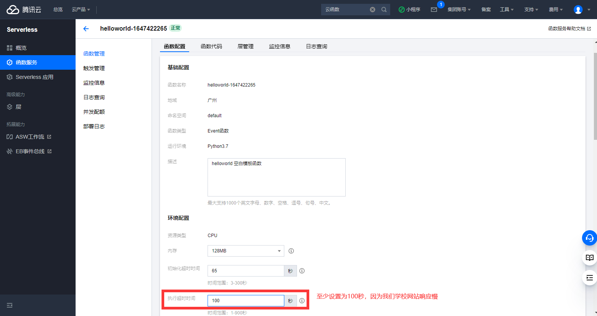
<br><br>
9.保存设置
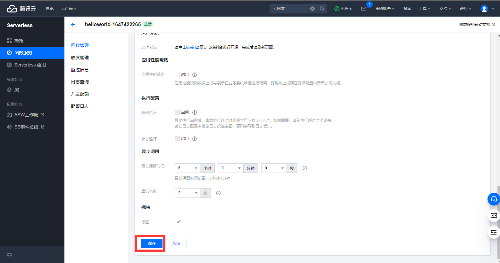
<br><br>
10.进入函数代码模块

<br><br>
11.测试代码可用性
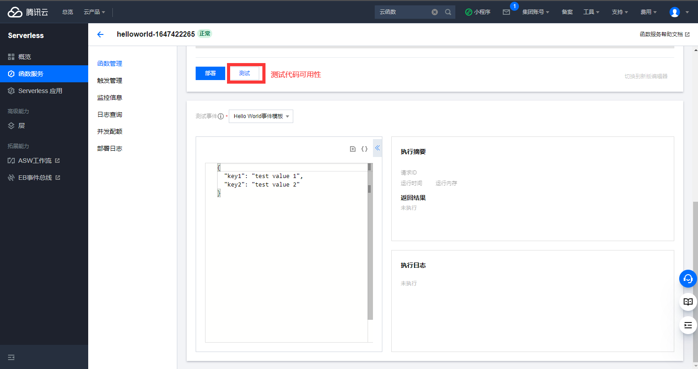
<br><br>
12.查看测试日志，没有Error并且收到了发送的邮件通知，说明一切OK。
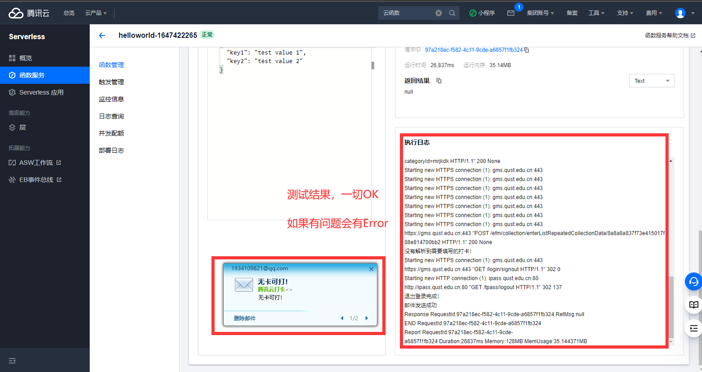
<br><br>
**大功告成，enjoy it !!!**
<br><br>
如果需要修改触发时间，删除新建即可
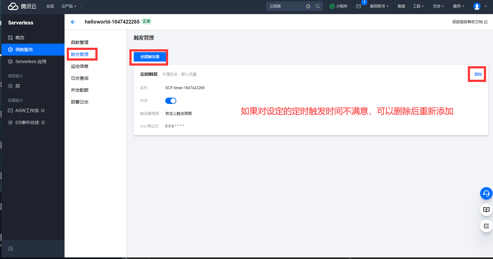

### 注意

由于各种不可抗拒力，自动化打卡不保证一定成功，请勿过度依赖！！！

默认打卡地点为崂山区，可以自己修改成其他地区，需要修改的参数为：```szd```和```szd_text```。

```shell
# 地区名对应行政区划代码（理论上是）
  szd_text               szd
-------------------------------
山东 - 青岛市 - 市北区    370203
山东 - 青岛市 - 崂山区    370212
山东 - 日照市 - 莒县      371122
```

```
# ---------------------  提交数据，固定格式请勿乱动！！！ ---------------------
data = {
        "id": None,
        "collectId": parent_data_id,
        "data": {
                "szd": "370212", # 所在地。。崂山区370212，至于其他城市有时间再添加 
                "tw": "37.2℃及以下", # 体温。。仅可自行修改为：37.2℃及以下、37.3℃-37.9℃、38℃及以上
                "stzk": "健康", # 身体状况。。仅可自行修改为：健康、发烧、干咳、乏力、其他
                "zgfxq": "否", # 近14天你或你的共同居住人是否有疫情中、高风险区域人员接触史。。仅可自行修改为：是、否
                "mj": "否", # 近14天你或你的共同居住人是否和确诊、疑似病人接触过。。仅可自行修改为：是、否
                "ysbl": "否", # 近14天你或你的共同居住人是否是确诊、疑似病例。。仅可自行修改为：是、否
                "yxgl": "否", # 你和你的共同居住人目前是否被医学隔离。。仅可自行修改为：是、否
                "jkmys": "绿色", # 今天你当地的健康码颜色是。。仅可自行修改为：绿色、黄色、红色
                "cn": "是", # 本人是否承诺以上所填报内容属实、准确，不存在任何隐瞒与不实情况，更无遗漏之处。。仅可自行修改为：是、否
                "szd_text": "山东 - 青岛市 - 崂山区", # 所在地全称：山东 - 青岛市 - 崂山区，以下数据信息同上
                "tw_text": "37.2℃及以下",
                "stzk_text": "健康",
                "zgfxq_text": "否",
                "mj_text": "否",
                "ysbl_text": "否",
                "yxgl_text": "否",
                "jkmys_text": "绿色",
                "cn_text": "是"
                },
        "collectChildId": child_data_id
}
```

打卡失败原因
```
1. 账号或密码错误
2. 请关闭vpn或网络代理软件
3. 我也不知道了
```

### 声明
对于用户使用该项目可能造成的不良后果，本人概不负责！！！
