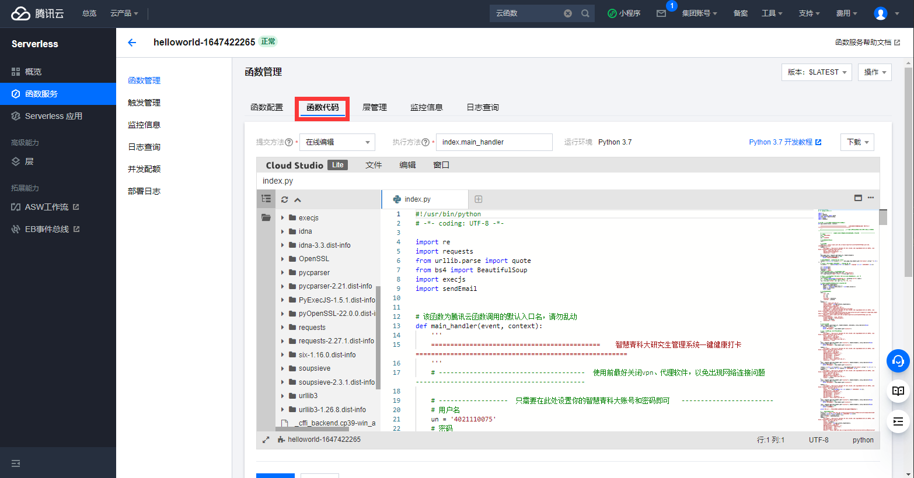

# 智慧青科大健康打卡腾讯云版

### 下载
```
git clone https://github.com/crazy-zxx/HealthRecordCloud.git
```
或者直接 code --> Download Zip ，然后解压

### 使用

#### 配置

```
# 进入目录，直接下载的解压后文件夹名字可能是HealthRecordCloud-master
cd HealthRecordCloud
```
修改main.py中的用户名密码
```
# ------------------  只需要在此处设置你的智慧青科大账号和密码即可   ------------------------
# 用户名
un = '4021110075'
# 密码
pd = '12345678'
```
修改sendEmail.py中的邮箱配置
```
# 使用第三方 SMTP 服务（请自行参照邮箱厂商提供信息修改）
# 以QQ为例
mail_host = "smtp.qq.com"  # 设置服务器
mail_user = "1934109821@qq.com"  # 用户名（你的QQ账号@qq.com）
mail_pass = "qwertyuiopasdfgh"  # 口令（先要开启SMTP，口令是16位字母）

# 发件人邮箱
sender = '1934109821@qq.com'
# 收件人邮箱(设置为自己接受邮件通知的邮箱)
receivers = ['1934109821@qq.com']
```

#### 环境搭建
[点击进入腾讯云函数服务官网](https://cloud.tencent.com/product/scf)
<br><br>
1.直接QQ登录就行，右上角进控制台

<br><br>
2.搜索云函数

<br><br>
3.进入函数服务面板

<br><br>
4.创建一个新的函数服务

<br><br>
5.选择本项目所在目录上传代码

<br><br>
6.设置触发器，定时运行打卡

<br><br>
7.新函数服务创建完成，需要调整函数配置

<br><br>
8.设置执行超时时间，避免未执行完代码就结束了

<br><br>
9.保存设置

<br><br>
10.进入函数代码模块

<br><br>
11.测试代码可用性

<br><br>
12.查看测试日志，没有Error并且收到了发送的邮件通知，说明一切OK。

<br><br>
大功告成，enjoy it！
<br><br>
#### 注意
如果需要修改触发时间，删除新建即可


### 声明
对于用户使用该项目可能造成的不良后果，本人概不负责！！！